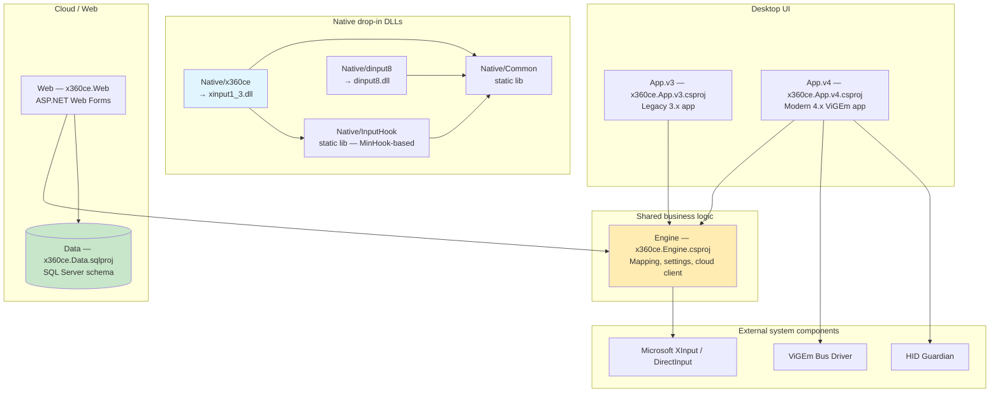
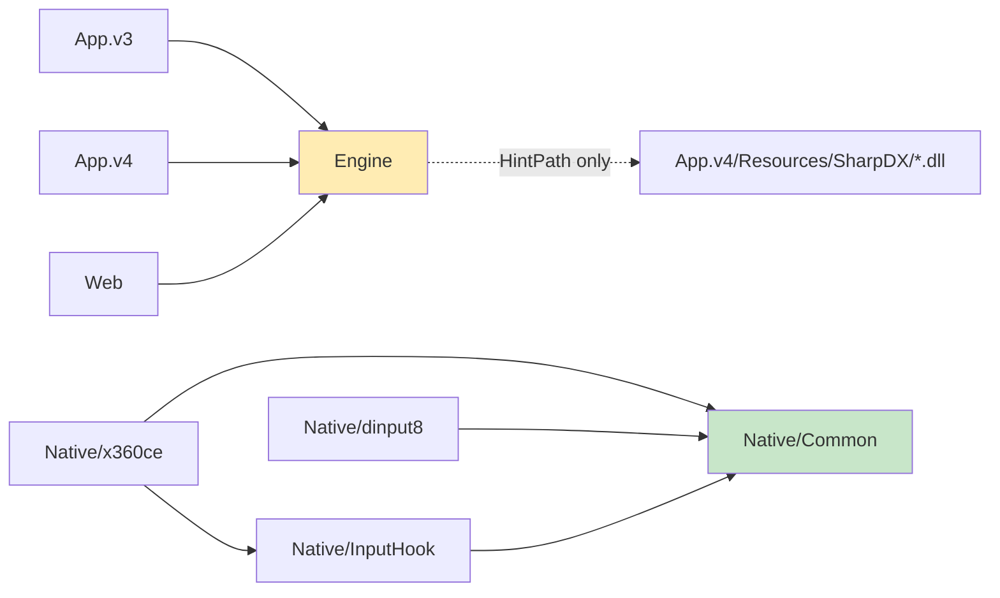
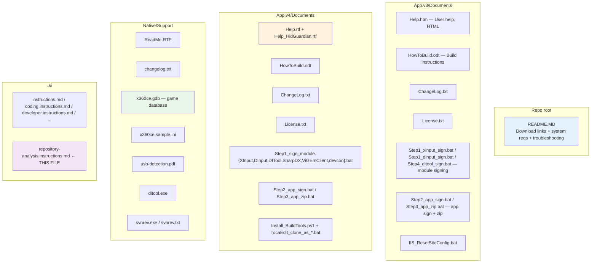

# x360ce Repository Analysis

## Project Overview

This section orients new contributors to what the repository actually ships and to whom. The Xbox 360 Controller Emulator (x360ce) is a Windows desktop tool plus a drop-in `xinput1_3.dll` that lets non-Xbox controllers (gamepads, joysticks, racing wheels, etc.) appear to games as Xbox 360 (XInput) controllers.

The repository ships two parallel desktop applications, a shared engine library, a database project, an ASP.NET web app for cloud features, and a set of native C++ projects that build the actual XInput-replacement DLL and a DirectInput shim.

The product targets PC gamers running games that only support XInput. Two product lines ship from the same repo:

- **v3.x line** — the legacy DLL-only XInput replacement (`xinput1_3.dll` + Win32 `dinput8.dll` plugin), x86 and x64 distributions.
- **v4.x line** — the modern ViGEm-bus-driver-based virtual gamepad approach with optional HID Guardian filtering.

## Developer-Provided Context

This section comes from `.ai/developer.instructions.md` and is authoritative — it overrides any conflicting findings derived from code analysis.

- **C# language version**: Use only C# language features up to and including version 7.3; do not use any features introduced in C# 8.0 or later.

## Technology Stack

This section documents specific framework and library versions so that build-environment and dependency decisions can be made without re-reading every project file.

### Managed (.NET) frameworks

All managed projects target the same framework:

- **.NET Framework v4.6.2** — `App.v3`, `App.v4`, `Engine`, `Web`, `Data` (sqlproj `TargetFrameworkVersion`).

There are no .NET (Core / 5+ / 8) projects in the current solution. There is no Directory.Build.props or Directory.Packages.props at the repo root; each project file is self-contained.

### Native (C++) toolchain

- **Platform toolset**: `v140` (Release) / `v141` (Debug) — selectable from `Build_All.cmd` via the `TOOLSET` env var (default `v141`).
- **Windows target platform version**: `10.0.26100.0` across all `.vcxproj` files.
- **`_WIN32_WINNT`**: pinned at `_WIN32_WINNT_WIN8` to preserve legacy XInput exports (`XInputEnable`, etc.). Bumping this macro breaks drop-in compatibility with old games.
- **MinHook**: bundled as a git submodule at `MinHook/` (build outputs not used directly — InputHook compiles MinHook sources in-tree).
- **DirectX SDK** (June 2010): referenced via `$(DXSDK_DIR)` for Win32 Debug builds.

### Key managed libraries

- **SharpDX 2.6.2** — DirectInput / XInput / RawInput wrappers. Referenced by `HintPath` from `App.v4/Resources/SharpDX/*.dll`.
- **ViGEm Client** — virtual gamepad driver client; managed wrapper code lives under `App.v4/ViGEm/Client/`.
- **System.Data.Entity** — Entity Framework (the older System.Data.Entity flavor, not EF Core).
- **JocysCom.ClassLibrary** — internal shared library; sources are copied into `Engine/JocysCom/`.

### Database

- **SQL Server**, compatibility level 100, code-first via SSDT.
- The `Data/x360ce.Data.sqlproj` schema project compiles only for the `APP_Any_v4` solution platform; other platforms have `Build` disabled.

### Web

- **ASP.NET Web Forms** on .NET Framework 4.6.2.
- Default IISExpress development port (refer to `Web/x360ce.Web.csproj` and `Web/Web.config`).

### Build tools

- **MSBuild** via Visual Studio 2022+ or VS 2026 Build Tools (located through `vswhere.exe`).
- **PowerShell 7+** (pwsh) for repo automation scripts (`Solution_Cleanup.ps1`).
- **Batch (`cmd /c`)** for distribution and signing scripts under each app's `Documents/` folder.

## Architecture Overview

This section captures the runtime topology so that contributors know which component to touch when changing controller mapping, persistence, cloud sync, or virtual-device behavior.



### Primary architectural pattern

A **layered architecture** with `Engine` as the central business-logic library shared by the two desktop apps and the web app. The native C++ projects are independent and run inside the host game's process; they communicate with the engine only by reading the on-disk INI files and the `x360ce.gdb` game database.

### Project dependency graph



Notes:

- `Engine` references its SharpDX dependencies via `HintPath` into `App.v4/Resources/SharpDX/` rather than as NuGet packages — this is a recent post-rename adjustment.
- `App.v4` has a `PreBuildEvent` that copies `x360ce.Engine.dll` (and optional `x360ce.Engine.XmlSerializers.dll`) from `Engine\bin\$(Configuration)\` into `App.v4\Resources\` for embedding as resources.

### Configuration approach

- **Desktop apps**: `app.config` per app (App.v3, App.v4) for `ConnectionStrings` and `appSettings`.
- **Web app**: `Web.config` with ASP.NET membership and database connection strings.
- **Native DLLs**: read settings from `x360ce.ini` placed alongside the host game executable (or under `%ALLUSERSPROFILE%\X360CE`).

## Project Structure

This section maps the on-disk layout to project identities so that a new contributor can locate the right `.csproj`/`.vcxproj` from a folder name.

After the May 2026 folder rename refactor, all projects keep the dotted `x360ce.*` filename for the project file but live in a parent folder that has the prefix stripped.

### Top-level layout

```
x360ce/
├── App.v3/                 # Legacy x360ce 3.x desktop app
├── App.v4/                 # Modern x360ce 4.x (ViGEm) desktop app
├── Engine/                 # Shared business-logic library
├── Web/                    # ASP.NET Web Forms cloud site
├── Data/                   # SQL Server schema project (sqlproj)
├── Native/
│   ├── Common/             # Static lib — shared C++ utilities
│   ├── InputHook/          # Static lib — MinHook-based hooks (HookCOM/DI/LL/SA/WT)
│   ├── x360ce/             # DynamicLibrary → xinput1_3.dll
│   ├── dinput8/            # DynamicLibrary → dinput8.dll
│   ├── ditool/             # Application — Win32 x86 console diagnostic tool
│   └── Support/            # Support assets (ReadMe.RTF, x360ce.gdb, etc.)
├── MinHook/                # Git submodule — bundled as source into InputHook
├── .agents/                # Agent-related scratch / configuration
├── .ai/                    # AI agent instructions (this folder)
├── .claude/                # Claude Code project settings
├── Build_All.cmd           # Builds all 5 solution platforms (vswhere → MSBuild)
├── MinHook_Update.cmd      # Submodule refresh helper
├── Solution_Cleanup.ps1    # bin/obj/.vs cleanup script
├── x360ce.slnx             # Solution file (XML .slnx format)
└── README.MD
```

### Managed projects

#### App.v3 (`App.v3/x360ce.App.v3.csproj`)

- **Project type**: `WinExe` (hybrid WinForms + WPF)
- **AssemblyName**: `x360ce`
- **RootNamespace**: `x360ce.App`
- **TargetFrameworkVersion**: `v4.6.2`
- **Project GUID**: `{737B79B1-5D5C-46D8-9D2B-BEAB460E42F0}`
- **Description**: Legacy x360ce 3.x desktop application — DLL-based XInput replacement workflow, ships as `x360ce.exe`. Builds for `APP_x86_v3` (x86) and `APP_x64_v3` (x64) solution platforms; not built for v4 or DLL platforms.

#### App.v4 (`App.v4/x360ce.App.v4.csproj`)

- **Project type**: `WinExe` (hybrid WinForms + WPF)
- **AssemblyName**: `x360ce`
- **RootNamespace**: `x360ce.App`
- **TargetFrameworkVersion**: `v4.6.2`
- **Project GUID**: `{00A8380D-72CB-4AD3-A8C4-0AF44BA2AEE0}`
- **Description**: Modern x360ce 4.x desktop application — ViGEm-based virtual gamepad workflow with optional HID Guardian. Builds only for the `APP_Any_v4` solution platform. Embeds the engine assembly and resources via a `PreBuildEvent` that copies from `Engine/bin/$(Configuration)/`.

#### Engine (`Engine/x360ce.Engine.csproj`)

- **Project type**: `Library`
- **AssemblyName**: `x360ce.Engine`
- **RootNamespace**: `x360ce.Engine`
- **TargetFrameworkVersion**: `v4.6.2`
- **Project GUID**: `{F980D78A-9448-4834-A6FE-84797077D309}`
- **Description**: Shared business-logic library used by both desktop apps and the web app. Houses controller mapping, settings persistence, cloud client, the JocysCom shared utilities (`Engine/JocysCom/`), and the EDMX/data layer in `Engine/Data/`. SharpDX assemblies are referenced via `HintPath` into `App.v4/Resources/SharpDX/`.

#### Web (`Web/x360ce.Web.csproj`)

- **Project type**: ASP.NET Web Application (Web Forms)
- **AssemblyName**: `x360ce.Web`
- **RootNamespace**: `x360ce.Web`
- **TargetFrameworkVersion**: `v4.6.2`
- **Project GUID**: `{EE2589B6-B2F3-44F9-A95C-17EBF74788FB}`
- **Description**: Cloud-side ASP.NET Web Forms application for sharing controller configurations, programs and presets. Provides ASP.NET Membership-based admin/user roles. Builds only for the `APP_Any_v4` solution platform.

#### Data (`Data/x360ce.Data.sqlproj`)

- **Project type**: SSDT Database project (`OutputType=Database`)
- **Name**: `x360ce.Data`
- **RootNamespace**: `x360ce.Data`
- **DSP**: `Sql100DatabaseSchemaProvider` (compatibility level 100)
- **Project GUID**: `{2DB521F4-E49D-4E7A-B1B9-52A8ACD37415}`
- **Description**: SQL Server schema project containing tables, stored procedures, and seed data for the x360ce cloud features. Builds only for the `APP_Any_v4` solution platform (other platforms map to AnyCPU but have build disabled in `x360ce.slnx`).

### Native projects

All `.vcxproj` files target `WindowsTargetPlatformVersion=10.0.26100.0` and use platform toolset `v140` for Release and `v141` for Debug.

#### Native/x360ce (`Native/x360ce/x360ce.vcxproj`)

- **ConfigurationType**: `DynamicLibrary`
- **TargetName**: `xinput1_3` (produces `xinput1_3.dll`)
- **CharacterSet**: `MultiByte`
- **Project GUID**: `{303D4435-7541-4357-91B1-CC9DA7E0E926}`
- **Output**: `bin\$(Configuration)\` for Win32; `bin64\$(Configuration)\` for x64.
- **PreBuildEvent**: Generates a build revision via `genrev.cmd`. Path is fully qualified (`$(MSBuildProjectDirectory)\genrev.cmd`) — required by MSBuild 18 / VS 2026, which no longer resolves bare command names in PreBuildEvent.
- **AddressSanitizer**: enabled for Debug builds (`<EnableASAN>true</EnableASAN>`).
- **Description**: The drop-in XInput replacement DLL that games load. Translates XInput API calls to DirectInput, applies the user's mapping from `x360ce.ini`, and reads game-specific hook masks from `x360ce.gdb`.

#### Native/dinput8 (`Native/dinput8/dinput8.vcxproj`)

- **ConfigurationType**: `DynamicLibrary`
- **TargetName**: `dinput8` (produces `dinput8.dll`)
- **CharacterSet**: `Unicode`
- **Project GUID**: `{FE3BC27D-9B4F-4063-A6A5-04B38F79AD64}`
- **Description**: Optional DirectInput 8 spoof/wrapper DLL used to improve x360ce compatibility for games that bypass standard XInput loading.

#### Native/InputHook (`Native/InputHook/InputHook.vcxproj`)

- **ConfigurationType**: `StaticLibrary`
- **CharacterSet**: `MultiByte`
- **Project GUID**: `{4CF76641-C60B-4A26-8F44-DAA67B30512A}`
- **Description**: Static library that owns the in-process function hooks used by `xinput1_3.dll` and `dinput8.dll`. Built on top of MinHook (sources compiled in-tree) and split into `HookCOM`, `HookDI`, `HookLL`, `HookSA`, and `HookWT` units.

#### Native/Common (`Native/Common/Common.vcxproj`)

- **ConfigurationType**: `StaticLibrary`
- **CharacterSet**: `MultiByte`
- **Project GUID**: `{0CAEE158-51E4-4C81-8CAC-F39F744DAF2D}`
- **Description**: Shared C++ utilities: `IniFile`, `Logger`, `Mutex`, `Timer`, `WindowsVersion`, `StringUtils`, `Utils`. Linked into all of the dynamic native DLLs and the InputHook lib.

#### Native/ditool (`Native/ditool/ditool.vcxproj`)

- **ConfigurationType**: `Application` (Win32 console)
- **Platforms**: Win32 only (no x64 configuration)
- **PlatformToolset**: `v141` (Debug) / `v140_xp` (Release — XP-compatible build for diagnostic use)
- **Project GUID**: `{7BC57D19-1819-42D7-8F3B-DFF5ED66C750}`
- **Description**: Standalone DirectInput diagnostic tool (`ditool.exe`) used to enumerate and dump DirectInput device data; ships under `Native/Support/` as a precompiled artifact.

### Solution platform configurations

`x360ce.slnx` defines five solution-level platforms (combined with Debug/Release configurations):

| Solution Platform | Builds                                       | Purpose                                  |
|-------------------|----------------------------------------------|------------------------------------------|
| `DLL_x86_v3`      | Engine (x86) + native vcxproj projects (Win32) | v3 native 32-bit DLL release             |
| `DLL_x64_v3`      | Engine (x64) + native vcxproj projects (x64)   | v3 native 64-bit DLL release             |
| `APP_x86_v3`      | Engine + App.v3 (x86)                          | v3 desktop app, 32-bit                   |
| `APP_x64_v3`      | Engine + App.v3 (x64)                          | v3 desktop app, 64-bit                   |
| `APP_Any_v4`      | Engine + App.v4 + Web + Data                   | v4 desktop app + cloud + database schema |

The native vcxproj projects are listed under all platforms but have `Build="false"` on the APP_* platforms, so they only build for the DLL_* platforms.

## Input Pipeline (App.v4)

This section is included because controller-mapping changes are the most common reason to touch `App.v4`, and the input pipeline is where most regressions originate.

The actual input pipeline in this repository is a **6-step `DInputHelper`** (not an `InputOrchestrator`). The class lives in [App.v4/Common/DInput/DInputHelper.cs](App.v4/Common/DInput/DInputHelper.cs) and is split across partial files:

```
App.v4/Common/DInput/
├── DInputHelper.cs                       # Coordination, threading, frequency control
├── DInputHelper.XInputLibrarry.cs        # XInput library load/swap (typo preserved)
├── DInputHelper.Step1.UpdateDevices.cs   # Device enumeration and capability load
├── DInputHelper.Step2.UpdateDiStates.cs  # Read DirectInput JoystickState → CustomDiState
├── DInputHelper.Step3.UpdateXiStates.cs  # Convert CustomDiState → XInput state per mapping
├── DInputHelper.Step4.CombineXiStates.cs # Combine multi-controller states (Combine Into)
├── DInputHelper.Step5.VirtualDevices.cs  # Push state to ViGEm virtual gamepads
├── DInputHelper.Step6.RetrieveXiStates.cs# Read live XInput state for UI display
├── DInputEventArgs.cs / DInputException.cs
├── Recorder.cs                           # Input recording for macros
├── VirtualDriverInstaller.cs / VirtualError.cs
```

Frequencies (configured at runtime, not compile-time):

- **Process 1** (input update loop): `[125, 250, 500, 1000] Hz` — runs continuously.
- **Process 2** (UI refresh): `30 Hz` — only when a window is visible.

The high-frequency loop has hard performance constraints — see the warning section below.

### Performance warning — high-frequency loops

Code reached from the `DInputHelper` 1000 Hz loop runs >1,000,000 times per minute. Avoid:

- `Debug.WriteLine` / `Console.WriteLine` in hot paths.
- `String.Format`, string interpolation, or `StringBuilder` allocations per tick.
- File I/O, network calls, EF/SQL access, exception logging with formatting.
- `Thread.Sleep` or any blocking call.
- Allocating new objects per tick (boxes / `new` / large arrays).

Prefer:

- `#if DEBUG` for any diagnostic logging.
- Pre-allocate arrays/buffers outside the loop.
- Use primitives and `ref`/`out` to avoid copies.
- Cache expensive computations in the device-detection path (`Step1.UpdateDevices`), which only runs when devices arrive/leave.

## Build, CI/CD & Testing

This section documents how to build the repository and what (limited) automated test surface currently exists.

### Building

The supported entry point is the repo-root [`Build_All.cmd`](Build_All.cmd):

```cmd
:: Default = Release
Build_All.cmd

:: Or explicitly
Build_All.cmd Debug
Build_All.cmd Release
```

It locates MSBuild via `vswhere.exe` (fails fast if Visual Studio 2022+ or VS 2026 Build Tools are not installed) and builds all five solution platforms in sequence:

1. `DLL_x86_v3`
2. `APP_x86_v3`
3. `DLL_x64_v3`
4. `APP_x64_v3`
5. `APP_Any_v4`

Stops on the first failure. The platform toolset can be overridden via `set TOOLSET=v142` etc. before invoking the script.

To build a single project from PowerShell, target it through the solution and pass the relevant solution platform; building the .csproj directly with `dotnet build` is not supported because these are .NET Framework projects, not SDK-style.

### Tests

There are currently **no test projects** in `x360ce.slnx`. The `x360ce.Net48Test` and `x360ce.Net60Test` projects referenced in earlier versions of this document are no longer part of the repository. A future re-introduction would naturally live alongside the consumer it tests (e.g. `Engine/Engine.Tests/` or similar) and would be added to the solution explicitly.

### CI / CD

There is no committed CI/CD pipeline definition in the repository (no `.github/workflows/`, no `azure-pipelines.yml`). Release artifacts are produced manually using the `Step*_*.bat` signing and packaging scripts in `App.v4/Documents/` and `App.v3/Documents/`.

## Documentation Structure

This section indexes the documentation surface so that contributors know where end-user help, build instructions, and signing workflows live.



### Primary documentation files

- **`README.MD`** — User-facing entry point: download links for v3 and v4, system requirements (Windows 10+, .NET Framework 4.x, DirectX June 2010 runtime, VC++ Redistributable 2015–2022), troubleshooting recipes, screenshots.
- **`App.v3/Documents/Help.htm`** — End-user help for the v3 application.
- **`App.v4/Documents/Help.rtf`** — End-user help for the v4 application; **embedded as a resource** into the v4 binary via `<EmbeddedResource Include="Documents\Help.rtf" />`.
- **`App.v4/Documents/Help_HidGuardian.rtf`** — HID Guardian setup; **also embedded** into the v4 binary.
- **`App.v3/Documents/HowToBuild.odt` / `App.v4/Documents/HowToBuild.odt`** — Per-app build instructions in OpenDocument format.
- **`Native/Support/ReadMe.RTF`** — Native-layer integration notes; referenced from the solution under the `/Support/` solution folder.
- **`Native/Support/usb-detection.pdf`** — USB controller detection technical reference.

### Build / signing / packaging scripts

Both apps follow a parallel `Step1 → Step2 → Step3 → Step4` workflow under their respective `Documents/` folder:

- **Step1 — module sign**: code-sign each redistributed DLL (`SharpDX.*`, `ViGEmClient`, `devcon`, the native `xinput1_*`/`dinput8` DLLs, `ditool.exe`).
- **Step2 — app sign**: code-sign the application executable.
- **Step3 — app zip**: package the signed binaries plus presets/resources into the release zip.
- **Step4** (v3 only): `Step4_ditool_sign.bat` — sign the diagnostic tool.

The `App.v4/Documents/` folder additionally contains:

- `Install_BuildTools.ps1` — bootstraps the build toolchain.
- `TocaEdit_clone_as_GIT.bat` / `TocaEdit_clone_as_SVN.bat` — historical mirroring helpers.
- `IIS_ResetSiteConfig.bat` — resets the IIS Express site configuration for the Web project.

## Development Environment Requirements

This section lists the actual prerequisites needed to build the repo today, post-rename.

### Required

- **Visual Studio 2022 17.x or VS 2026 Build Tools** — `Build_All.cmd` discovers MSBuild via `vswhere.exe` and aborts if neither is installed.
- **Workloads / components**:
  - .NET desktop development (provides .NET Framework 4.6.2 targeting pack).
  - Desktop development with C++ (provides MSVC v140 / v141 toolsets).
  - Windows 10 / 11 SDK matching `WindowsTargetPlatformVersion=10.0.26100.0`.
  - SQL Server Data Tools (SSDT) for the `Data/x360ce.Data.sqlproj` project.
- **DirectX SDK (June 2010)** — referenced via `$(DXSDK_DIR)` for Win32 Debug builds of `Native/x360ce`.
- **MinHook submodule** — initialized via `git submodule update --init` (or refreshed by `MinHook_Update.cmd`).

### Runtime (for the produced binaries)

- **Windows 10 or newer**.
- **.NET Framework 4.x** (shipped with Windows 10/11).
- **DirectX End-User Runtime (June 2010)** — required by SharpDX.
- **Visual C++ Redistributable 2015–2022** — both x86 and x64 on 64-bit systems.
- **ViGEm Bus Driver** — required by the v4 application (bundled in `App.v4/Resources/ViGEmBus.zip`).
- **HID Guardian** (optional, v4 only) — bundled in `App.v4/Resources/HidGuardian.zip`.

### Optional development tools

- **PowerShell 7+** (pwsh) — already the VS Code default terminal in this workspace; do not wrap scripts with `powershell -File`.
- **IIS Express** (bundled with Visual Studio) — for the `Web` project.

## Terminal Environment & Command Syntax

This section is here because shell choice changes how every script in this repository must be invoked.

### PowerShell (default)

The VS Code integrated terminal in this workspace is **PowerShell 7+ Core (pwsh)**. Invoke `.ps1` files directly:

```powershell
./Solution_Cleanup.ps1
```

Do **not** wrap with `powershell -File ...` — that adds friction for no benefit.

PowerShell 7+ supports `&&` and `||` pipeline-chain operators just like bash, so prefer:

```powershell
cd Engine && dotnet build x360ce.Engine.csproj
```

over the older `;` form. (`;` runs the right side regardless of left-side success.)

### Batch scripts

All `Step*_*.bat`, `Build_All.cmd`, and `MinHook_Update.cmd` are CMD batch files. They run fine when invoked directly from pwsh, e.g. `./Build_All.cmd Release`.

### `dotnet build` and these projects

These are non-SDK-style .NET Framework 4.6.2 projects. `dotnet build` does work for them but is not the supported entry point — `Build_All.cmd` driving full MSBuild is. If you do invoke `dotnet build`/`msbuild` directly on a single project, pass the right solution platform (`/p:Platform=APP_Any_v4` etc.) or you'll hit "The OutputPath property is not set" errors.

## Key Technical Decisions

This section captures decisions that look surprising on first contact with the codebase, so contributors don't try to "fix" them.

### Two parallel desktop apps (App.v3 and App.v4)

Both apps share the same `AssemblyName=x360ce`, the same `RootNamespace=x360ce.App`, and the same `TargetFrameworkVersion=v4.6.2`. They diverge in feature set and runtime model:

- **App.v3** corresponds to the v3.x release line — DLL-replacement workflow, libusb-era device handling, x86/x64 desktop targets.
- **App.v4** corresponds to the v4.x release line — ViGEm-bus virtual gamepad workflow, AnyCPU, additional cloud features.

Keeping them as two projects with shared `Engine` allows each release line to evolve independently without forking history. The tradeoff (declared technical debt as of May 2026) is that the namespace `x360ce.App` is identical in both — the version distinction lives in the project filename and folder, not in code.

### Hybrid WPF + WinForms UI

Both desktop apps reference `PresentationCore`, `PresentationFramework`, `WindowsBase`, `WindowsFormsIntegration` and `System.Windows.Forms`. WPF `<Page>` items (e.g. `Controls/PadTabPages/MacrosControl.xaml`, `Controls/PadTabPages/General/XboxImageControl.xaml`) coexist with WinForms designer files (`*.Designer.cs` with embedded `.resx`). New UI prefers WPF; existing WinForms surfaces are kept as-is.

### `_WIN32_WINNT` pinned to WIN8

The native `xinput1_3.dll` is a drop-in for old games that may load it into very old hosts. Bumping `_WIN32_WINNT` past WIN8 breaks legacy XInput exports such as `XInputEnable`. This constraint is recorded in user memory and must not be raised without a release-line decision.

### Engine references SharpDX via HintPath into App.v4/Resources

`Engine/x360ce.Engine.csproj` does not consume SharpDX as a NuGet package; it points `HintPath` at `..\App.v4\Resources\SharpDX\*.dll`. This means a clean repo can compile `Engine` only after the SharpDX DLLs exist under `App.v4/Resources/SharpDX/` (they are checked in). Do not delete those binaries — there is no NuGet fallback.

### Native projects skip build on APP_* platforms

In `x360ce.slnx`, every native `.vcxproj` has `<Build Solution="*|APP_*v3" Project="false" />` and `<Build Solution="*|APP_Any_v4" Project="false" />`. The native DLLs are only built under `DLL_x86_v3` / `DLL_x64_v3`. A "build the app" workflow does not rebuild the native DLLs — packaged binaries from a prior `DLL_*_v3` build are expected.

### `ditool` is Win32-only and uses `v140_xp`

`Native/ditool/ditool.vcxproj` defines no x64 configuration and uses the `v140_xp` toolset for Release. It is a standalone diagnostic tool that ships compiled under `Native/Support/ditool.exe`; the source tree allows rebuilding it but it is not part of any DLL or APP solution-platform output.

### MSBuild 18 PreBuildEvent path requirement

`Native/x360ce/x360ce.vcxproj` uses an explicit `$(MSBuildProjectDirectory)\genrev.cmd` path in its `PreBuildEvent`. MSBuild 18 (VS 2026) does not resolve bare command names in PreBuildEvent the way earlier versions did, so any new pre/post-build script must use `$(MSBuildProjectDirectory)` (or another fully-qualified macro) explicitly.

## Security and Deployment

This section covers signing, driver dependencies, and distribution mechanics that are easy to overlook when first contributing release-side work.

### Code signing

The project ships only signed binaries. Each app has a 3–4 step signing pipeline under `App.{v3|v4}/Documents/`:

- **Module signing** (`Step1_*`) — every redistributed binary (`xinput1_*`, `dinput8`, `SharpDX.*`, `ViGEmClient.dll`, `devcon.exe`, `ditool.exe`) is signed individually before the application embed step.
- **Application signing** (`Step2_app_sign.bat`) — signs the final `x360ce.exe`.
- **Distribution packaging** (`Step3_app_zip.bat`) — produces the release zip from the signed tree.

Publishing unsigned builds is explicitly discouraged in `Documents/Help.*`.

### Driver dependencies

- **ViGEm Bus** (kernel-mode virtual gamepad driver) — required by the v4 application. Bundled installer at `App.v4/Resources/ViGEmBus.zip`. Installation requires admin privileges.
- **HID Guardian** — optional v4 component for hiding physical controllers from games that double-enumerate. Bundled installer at `App.v4/Resources/HidGuardian.zip`. Removing HID Guardian incorrectly can lock the user out of mouse/keyboard input — follow the procedure linked from `README.MD`.

### Distribution channels

- **GitHub Releases** is the only published distribution channel (URLs are in `README.MD`).
- v3 ships separate `x360ce_x86.zip` and `x360ce_x64.zip` archives.
- v4 ships a single `x360ce.zip` plus the ViGEm Bus driver installer.

### Web service security

The `Web` project uses ASP.NET Membership for authentication and role-based authorization (admin / user). Database connection strings live in `Web.config` and should be injected at deploy time — never committed.

### Game database (`x360ce.gdb`)

`Native/Support/x360ce.gdb` is a binary game database keyed by executable name + checksum that supplies per-game `HookMask` overrides to the native DLL. It is not personally identifying and may be redistributed; the v4 app also embeds a compressed copy at `App.v4/Resources/x360ce_Games.xml.gz`.
